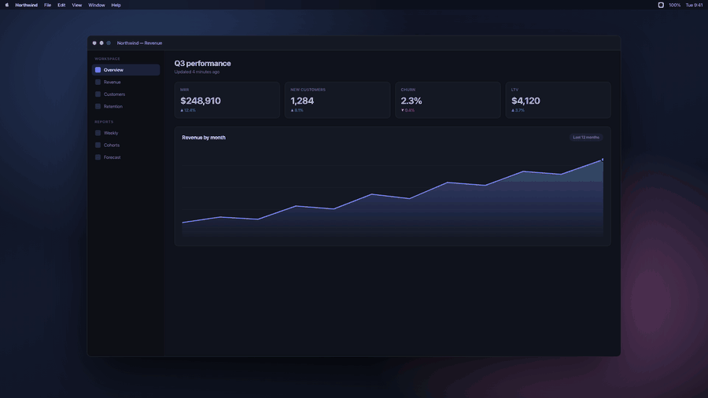
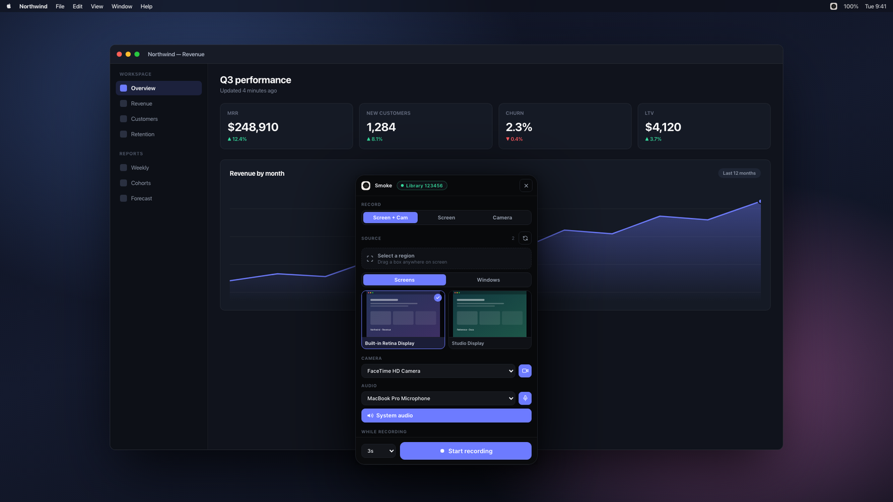
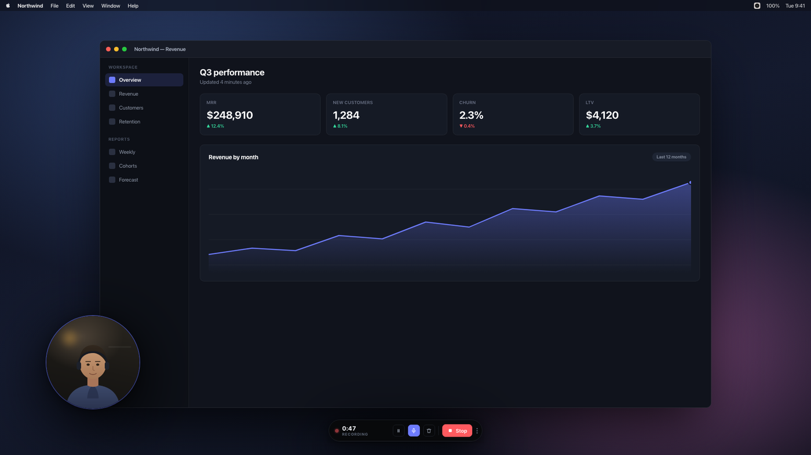
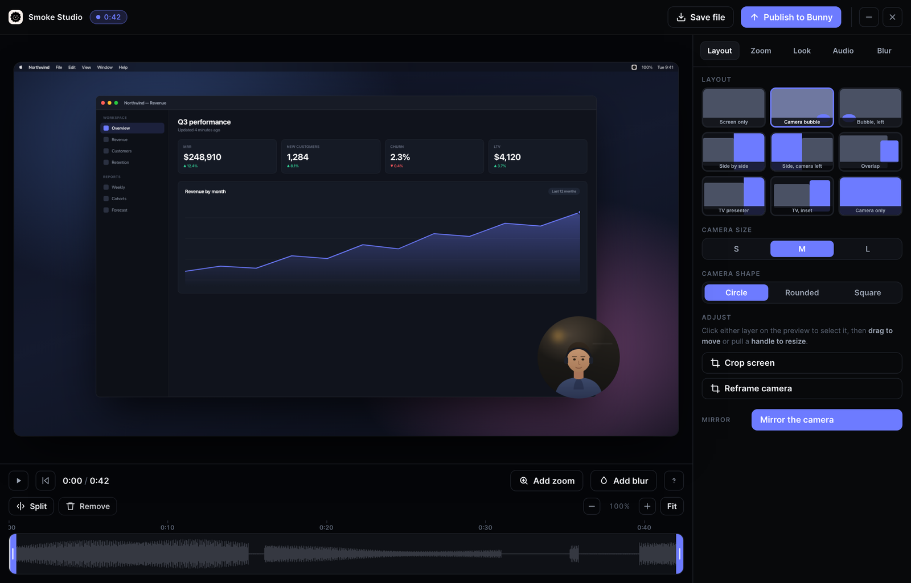
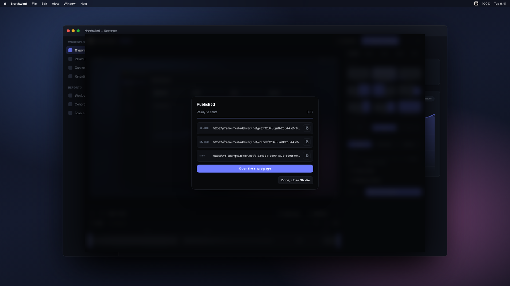
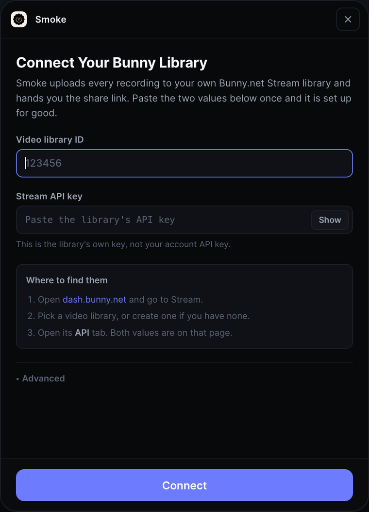

# Smoke

A screen recorder that hands you a share link, like Loom, except the videos
live in your own Bunny.net library and the bill is cents instead of seats.



macOS only. Free and open source. You bring a Bunny.net account.

## Why This Exists

Loom is a good product with a pricing model that punishes you for having
colleagues. Every person who needs to send a video is another $18 a month, and
your entire library sits on someone else's servers under someone else's terms.

Smoke does the part you actually use, which is: record something, trim it,
send a link. The recording is transcoded and served by
[Bunny.net Stream](https://bunny.net/stream/), which charges for storage and
bandwidth rather than for people.

At Bunny's published rates, storage is **from $0.01/GB per month**, delivery is
**from $0.005/GB**, and encoding is **free**.

| | Loom Business | Smoke on Bunny |
| --- | --- | --- |
| 1 person, 20 videos a month | $18/mo | pennies |
| 5 people, 100 videos a month | $90/mo | still pennies |
| 20 people | $360/mo | still pennies |
| Where the videos live | Loom | your Bunny library |
| Cost driver | seats | GB stored and GB watched |

A worked example, so the "pennies" is checkable rather than a slogan. Twenty
six-minute 1080p videos a month, roughly 250MB each once Bunny has built the
full rendition ladder, each watched ten times at around 60MB a view:

- **Storage** after a full year of that, about 60GB, is around **$0.60/month**
- **Delivery**, 200 views a month at ~60MB, is around **$0.06/month**

Your numbers will be different. The point is the shape: the cost tracks how
much video you keep and how much it gets watched, and it does not care how many
people are on the team. Bunny bills your account directly, so check their
current rates rather than trusting this table forever.

## What It Does

**Pick exactly what gets recorded.** Any screen, any window, or drag out a
region. There is also a Chrome extension for capturing a single tab, which a
native app fundamentally cannot do.



**A camera bubble you can actually move.** Floating, always on top, draggable
from anywhere on it. Scroll over it to resize. It is hidden from the capture
and recorded as its own track, so you can reposition it later, or burn it in
live if you prefer.



**An editor, not just a trimmer.** When you stop, Studio opens with the take
already loaded.



- **Timeline segments.** Split at the playhead, select a piece, delete it.
  Playback skips what you removed, so the preview matches the export exactly.
- **Zooms** you place on the timeline, with the framing you choose.
- **Blur, pixelate or block out** anything on screen you did not mean to show.
- **Nine layouts** for screen and camera, plus independent crop and reframe for
  each, so you can fix a badly framed webcam after the fact.
- **Backgrounds**, 16 linear gradients and 12 mesh ones, with padding and
  corner rounding.
- **Voice cleanup.** The mic is recorded to its own file, so the cleanup can
  gate and compress your voice without chewing up whatever audio you were
  demoing. Measured on an isolated take, the studio setting gives 55dB of
  speech to gap separation against 26dB raw, which is what removes the sound
  of you breathing between sentences.

**Publish and paste.** One button uploads to your library, waits for Bunny to
finish encoding, and copies the share link to your clipboard.



## Install

You need a Mac, [Node.js](https://nodejs.org), and a Bunny.net account with a
Stream video library.

```bash
git clone https://github.com/vedant5000/smoke.git ~/Desktop/Smoke
cd ~/Desktop/Smoke
bash setup.sh
```

That installs dependencies, fetches ffmpeg, creates a local signing identity,
and builds Smoke into your Applications folder.

Smoke lives in the **menubar**, not the Dock. Click the mark near the clock.

**Or hand it to Claude Code.** The repo carries a `CLAUDE.md`, so
`claude "set up Smoke"` in the cloned folder is enough.

### Connecting Bunny

On first launch Smoke asks for two values, both on one page in the Bunny
dashboard under Stream, your library, then the API tab.



They are checked against Bunny before anything is saved, so a wrong paste fails
here rather than at the end of your first recording. Credentials are stored per
user in `~/Library/Application Support/smoke/.env` and never touch this repo.
Change them later from the menubar: right click, **Change Bunny credentials**.

Use the library's own API key, not your account key. The account key can create
and delete entire libraries and Smoke never reads it.

### The One Permission That Trips Everyone Up

macOS will ask for Screen Recording, Camera and Microphone. After you grant
**Screen Recording**, quit Smoke and open it again. macOS only applies that
particular grant when the app restarts, and until you do, the source list comes
up empty and Start stays disabled.

## Why A Signing Certificate

`setup.sh` creates a self signed certificate called "Smoke Local Signing".
macOS ties Screen Recording permission to an app's code signature, and an ad
hoc signature changes on every rebuild, so macOS decides it is a different app
and throws away the permission you just granted. A stable identity keeps it.

The certificate is not added to your system trust store and can only sign this
app. Delete it any time from Keychain Access.

## Good To Know

- **macOS only.** It uses ScreenCaptureKit, the macOS menubar and macOS content
  protection.
- **Not notarised.** You build it yourself, so Gatekeeper is not involved. If
  somebody hands you a prebuilt copy, run
  `xattr -dr com.apple.quarantine /Applications/Smoke.app`.
- **No team features.** No comments, no reactions, no viewer list. If you need
  those, you want Loom. Bunny gives you view counts and watch time.
- **Your Bunny bill is yours.** Smoke never sees it and cannot spend on your
  behalf beyond uploading what you record.
- **Smoke's own windows never appear in your recordings.** The panel, the
  recording bar and the countdown are marked as protected content, the same
  macOS capability password managers use.
- **It pairs with [Cue](https://github.com/vedant5000/cue)** if you have it
  installed, for a teleprompter that screen share cannot see. Smoke works fine
  without it.

## After Changing Any Code

```bash
bash build.sh
```

The app in Applications is a frozen copy. Editing files does nothing until you
rebuild. `npm run dev` runs it from source with the console in your terminal.

## Documentation

- **[docs/internals.md](docs/internals.md)** is the real reference: how the
  thing is built and every hard won detail behind it, including a long list of
  traps that are already solved and should not be rediscovered.
- **[SETUP.md](SETUP.md)** is the step by step install for someone who has
  never touched the project.
- **[docs/screenshots/README.md](docs/screenshots/README.md)** explains how the
  images on this page are generated, since none of them are screen captures.

## License

MIT. See [LICENSE](LICENSE).
